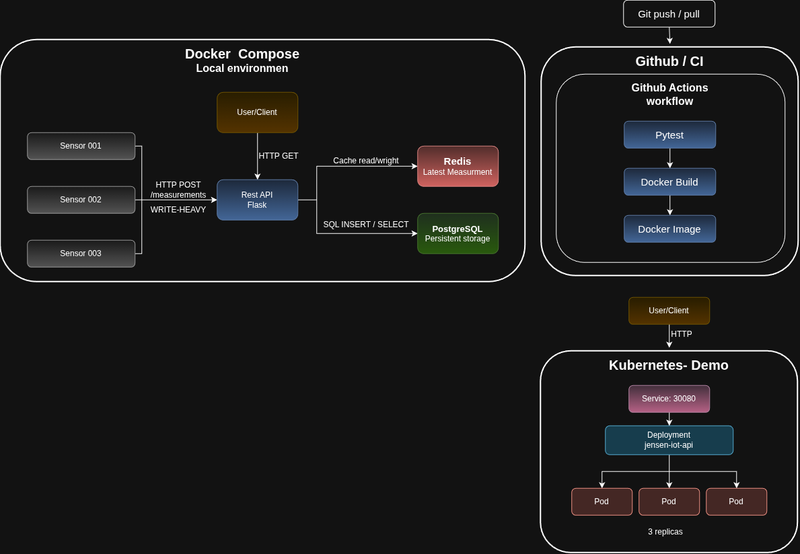

# System Architecture

The DIagram shows the system architecture dived in to three main parts: the local environment, CI pipeline and the Kubernetes deployment.

In the local environment, three simulated sensors communicate with the Flask REST API by sending measurements through `POST /measurement`. The API stores the measurements in PostgreSQL, witch provides persistent history, and uses Redis to keep the latest measurement for each sensor available as a cache.

The CI pipeline is triggered by pushes and pull requests to the Github repository. Github Actions runs the projects pytest tests, and if workflow is successful, builds the Docker image containing the API. 

The Kubernetes setup demonstrates running the API with multiple replicas. A Kubernetes Service provides access to the application,while the Deployment manages the tree pods and ensures that the desired number of pods is maintained if a pod stops running.  

